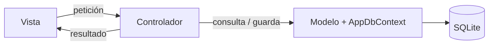

# Gestión de Usuarios — CRUD con Login en ASP.NET Core MVC

Aplicación web que implementa un **CRUD de usuarios** (crear, leer, actualizar y eliminar) protegido por un **sistema de inicio de sesión**. Fue desarrollada con el patrón **Modelo-Vista-Controlador (MVC)** como Tarea de la materia **Ingeniería Web (ISWZ3101)** de la UDLA.

> 🎥 **Video demostrativo:** _[enlace pendiente]_

---

## Tabla de contenidos

1. [Funcionalidades](#funcionalidades)
2. [Tecnologías](#tecnologías)
3. [Estructura del proyecto (MVC)](#estructura-del-proyecto-mvc)
4. [Instalación y ejecución](#instalación-y-ejecución)
5. [Usuario de prueba](#usuario-de-prueba)
6. [Cómo funciona la seguridad](#cómo-funciona-la-seguridad)
7. [Rutas de la aplicación](#rutas-de-la-aplicación)
8. [Autor](#autor)

---

## Funcionalidades

- **Inicio y cierre de sesión**: con usuario y contraseña.
- **CRUD completo de usuarios:** listar, ver detalle, crear, editar y eliminar.
- **Rutas protegidas:** si no hay una sesión iniciada, ninguna página del CRUD es accesible, ni siquiera escribiendo la URL directamente en el navegador.
- **Contraseñas cifradas**: en la base de datos; nunca se guardan en texto plano.
- **Validaciones:** campos obligatorios, formato de correo, contraseña de mínimo 6 caracteres, confirmación de contraseña y nombre de usuario único.
- **Protección extra:** un usuario no puede eliminar la cuenta con la que inició sesión.

## Tecnologías

| Tecnología | Uso |
|---|---|
| **.NET 10 / ASP.NET Core MVC** | Framework web y patrón MVC. |
| **C#** | Lenguaje del backend. |
| **Entity Framework Core** | ORM: conecta las clases de C# con la base de datos. |
| **SQLite** | Base de datos en un solo archivo (`crudlogin.db`). (Se utlizo esto para evirar instalaciones innesesarias) |
| **Autenticación por cookies** | Manejo de la sesión del usuario. |
| **PasswordHasher (PBKDF2)** | Cifrado de contraseñas. |
| **Razor + Bootstrap 5** | Vistas y estilos. |

## Estructura del proyecto (MVC)

```
CrudLoginMvc/
├── Models/                       ← MODELO: los datos
│   ├── Usuario.cs                  Tabla "Usuarios" (cada propiedad es una columna).
│   ├── LoginViewModel.cs           Datos del formulario de login.
│   └── UsuarioFormViewModel.cs     Datos del formulario de crear/editar.
|
├── Views/                        ← VISTA: lo que ve el usuario
│   ├── Cuenta/Login.cshtml         Formulario de inicio de sesión.
│   ├── Usuarios/                   Index, Details, Create, Edit, Delete y el parcial _Formulario.
│   └── Shared/_Layout.cshtml       Plantilla común (menú, botón de cerrar sesión).
|
├── Controllers/                  ← CONTROLADOR: recibe la petición y decide qué hacer
│   ├── CuentaController.cs         Login y logout.
│   ├── UsuariosController.cs       CRUD de usuarios (protegido con [Authorize]).
│   └── HomeController.cs           Página de inicio.
|
├── Data/
│   └── AppDbContext.cs           Contexto de la base de datos (Entity Framework Core).
|
├── Program.cs                    Configuración: base de datos, cifrado, login y usuario inicial.
└── appsettings.json              Cadena de conexión y datos del administrador inicial.
```


**Flujo de una petición:** El usuario hace clic en una vista → el **controlador** recibe la petición → consulta o modifica los datos a través del **modelo** → devuelve una **vista** con el resultado.



## Instalación y ejecución

### Requisitos

- [.NET SDK 10](https://dotnet.microsoft.com/download) o superior.
- Opcional: Visual Studio 2022 (o más reciente) o Visual Studio Code.

### Pasos

1. Clonar el repositorio:
   ```bash
   git clone <URL-del-repositorio>
   cd CrudLoginMvc
   ```
2. Ejecutar la aplicación:
   ```bash
   dotnet run
  
   (En Visual Studio, también se puede abrir "CrudLoginMvc.csproj" y pulsar el boton *Ejecutar*)
   ```  
   
3. Abrir en el navegador la dirección que aparece en la consola (por defecto, `http://localhost:5074`).

> La base de datos `crudlogin.db` se **crea automáticamente** la primera vez que se ejecuta la aplicación, junto con el usuario administrador. No hace falta ejecutar migraciones ni scripts SQL.

## Usuario de prueba

| Usuario | Contraseña |
|---|---|
| `admin` | `Admin123!` |

(Estos datos se definen en `appsettings.json` (sección `AdminInicial`) y solo se usan para crear el primer usuario. Se recomienda cambiar la contraseña desde la opción **Editar** después del primer inicio de sesión.)

## Cómo funciona la seguridad

### 1. Contraseñas cifradas

Las contraseñas **nunca se guardan en texto plano**. Al crear o editar un usuario se guarda únicamente su **hash**, generado con `PasswordHasher`, que usa el algoritmo **PBKDF2 con *salt***.

Se eligió PBKDF2 en lugar de MD5 porque MD5 ya se considera inseguro: es muy rápido de calcular y existen tablas con millones de hashes precalculados. El *salt* hace que dos contraseñas iguales generen hashes distintos.

Al iniciar sesión, se cifra la contraseña escrita y se compara con el hash guardado (`VerifyHashedPassword`).

### 2. Sesión con cookie

Cuando el usuario inicia sesión, el servidor crea una **cookie cifrada** con su identificador y su nombre (*claims*). El navegador la envía en cada petición, y así la aplicación sabe quién es. Al cerrar sesión, la cookie se elimina. La sesión expira tras 30 minutos de inactividad.

### 3. Rutas protegidas con `[Authorize]`

El controlador `UsuariosController` tiene el atributo `[Authorize]`, que protege **todas** sus acciones. Si alguien sin sesión intenta entrar, por ejemplo, a `/Usuarios/Delete/1`, es redirigido al login con el mensaje *"No tienes permiso para entrar a esa sección. Inicia sesión primero."*

### 4. Otras medidas

- **Token antifalsificación (`[ValidateAntiForgeryToken]`)** en todos los formularios, para evitar ataques CSRF.
- **Mensaje genérico** cuando el login falla ("Usuario o contraseña incorrectos"), para no revelar qué usuarios existen.
- **Eliminación por POST:** un enlace (GET) solo muestra la confirmación; el borrado real se hace con un formulario.

## Rutas de la aplicación

| Ruta | Método | Descripción | ¿Requiere sesión? |
|---|---|---|---|
| `/` | GET | Página de inicio. | No |
| `/Cuenta/Login` | GET / POST | Formulario e inicio de sesión. | No |
| `/Cuenta/Logout` | POST | Cerrar sesión. | Sí |
| `/Usuarios` | GET | Lista de usuarios. | **Sí** |
| `/Usuarios/Details/{id}` | GET | Detalle de un usuario. | **Sí** |
| `/Usuarios/Create` | GET / POST | Crear usuario. | **Sí** |
| `/Usuarios/Edit/{id}` | GET / POST | Editar usuario. | **Sí** |
| `/Usuarios/Delete/{id}` | GET / POST | Eliminar usuario. | **Sí** |

## //Autor//

**Jean Carlos G.** — Estudiante de Ingeniería de Software, Universidad de Las Américas (UDLA), Ecuador.

Proyecto desarrollado para la materia Ingeniería Web (ISWZ3101), semestre 2027-1.
